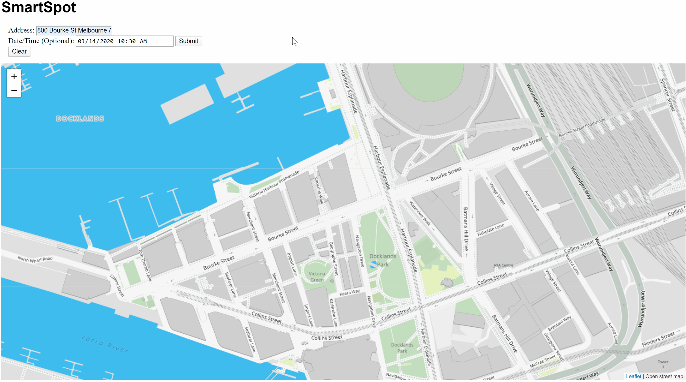

# Park App
Park App is a web app built with Python and Flask that is designed to predict and display the availability of parking in Downtown Melbourne Australia.

#### -- Project Status: Complete

## Project Objective
Park App is motivated by the desire to spend more time walking around a city and less driving around a city looking for parking. It is a full-stack machine learning project that was built during the SharpestMinds mentorship program.

### Methods Used
* Data Visualization
* Frequentist Inference
* Predictive Modeling

### Technologies
* Python
* Pandas, numpy
* MongoDB
* Flask
* HTML, JavaScript
* Sphinx
* pytest

## Project Description
As a part of the SharpestMinds mentorship program, mentees are encouraged to build a full-stack machine learning project with oversight from their mentor. My mentor, Brian Godsey, and I spend a couple weeks kicking around different ideas, and exploring potential data sources. I had just moved to a new neighborhood in Boston where street parking was much more difficult to find, and I was interested to see if I could build some type of forecasting tool that would help me find parking faster.  

I stated searching in Boston for a parking related dataset, but could not find a set that would be robust enough to use for predictive modeling. I expanded my search and eventually found that the City of Melbourne had installed in-ground sensors to many of their parking spaces and had published the historical data on their own open data portal. This would be the data set that I would use to build ParkApp on.  

I started with an exploratory analysis of the data, to see if I could find any patterns to parking availability. This helped me find a few important features that would have an effect on availability. The first method I tried was a query-based approach which is would use frequentist inference to make a prediction on availability of a spot. With the query in place I was able to tune the parameters on a test set, and finally calculate classification performance metrics on a validation set.

Now that I had a way to make predictions about the availability of parking spots, I needed a way to make these easily accessible to and end user. I decided to use Flask to build out a web-app. That app in contained in this repo. The app allows a user to enter an address and a time at which they're interested in. The map will display the address that they selected, along with the nearby parking spots which are color coded to indicate potential availability.

## Documentation
Documentation can be built using [Sphinx](http://www.sphinx-doc.org/en/master/) in the `docs` folder by calling `make html`. It can also be accessed at https://parkapp.readthedocs.io/.

## Blog post
Read more about this project at [link]
